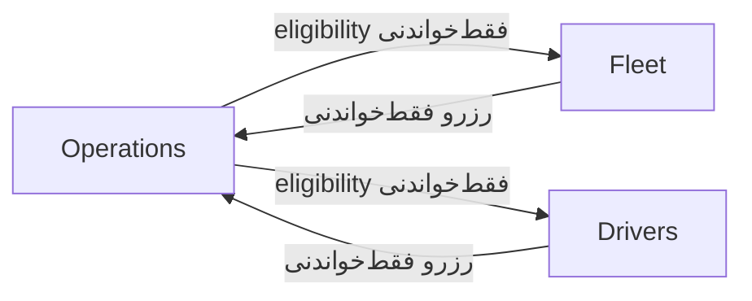
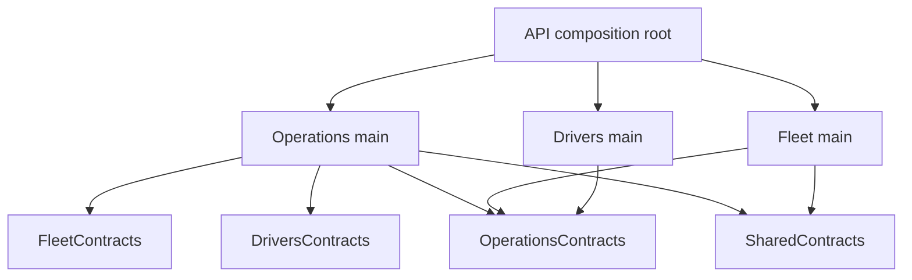

# D19؛ مالکیت ماژول‌ها و قراردادهای خواندن (M5)

تاریخ: ۲۰۲۶-۱۰-۰۹. مسیر حداقلی M5: مالکیت روشن، shared kernel فنی کوچک و
هماهنگی تراکنشی فعلی حفظ می‌شوند؛ بازطراحی سرویس/دیتابیس مستقل انجام نمی‌شود.

| مالک | داده/قاعده | پورت عمومی و مصرف‌کننده |
|---|---|---|
| Fleet | Vehicle، وضعیت/تعمیر، پلاک، نوع و ظرفیت | IFleetLookup؛ Operations برای eligibility |
| Drivers | Driver، وضعیت و صلاحیت‌ها | IDriverLookup؛ Operations برای eligibility |
| Operations | Mission، چرخهٔ وضعیت و مالکیت رزرو خودرو/راننده | IResourceReservations؛ Fleet برای تعمیر و Drivers برای availability |
| Fleet Application | ترکیب حقایق Fleet و رزرو Operations برای available vehicles | query خود Fleet؛ cache فقط snapshot همین خروجی |
| Infrastructure میزبان | پروتکل مشترک transaction/advisory lock و نسخهٔ کش | IAvailabilityCoordinator و IAvailabilityCache در Shared Contracts |
| Administration | خواندن Audit و سیاست دسترسی Administrator | IAuditQuery چارچوب؛ مالک نوشتن Audit نیست |

## ارتباط معنایی

این چرخهٔ معنایی واقعی است: صلاحیت تخصیص از منابع می‌آید، اما رزرو در Mission
نگهداری می‌شود. Contracts آن را حذف نمی‌کند؛ وابستگی فقط‌خواندنی را آشکار و
حدودش را محدود می‌کند. هیچ مصرف‌کننده entity یا setter ماژول دیگر را دریافت نمی‌کند.

## ارجاع قابل کامپایل

پروژهٔ main یک ماژول، main ماژول دیگر را reference نمی‌کند. داده‌های Contracts
snapshot/شناسه/مجموعهٔ فقط‌خواندنی‌اند؛ Entity، IQueryable، DbContext یا قواعد
مشترک کسب‌وکار ندارند. جهت رجوع پروژه‌ها با چرخهٔ معنایی بالا یکی نیست.
تست معماری این مرز و ممنوعیت EF/Transport/broker در Domain/Application را کنترل می‌کند.

## چرا یک AppDbContext و هماهنگ‌کنندهٔ مشترک

این محصول modular monolith با یک PostgreSQL است. Context میزبان، نگاشت‌های
ماژول‌ها و Audit را compose می‌کند تا تغییر یک aggregate، revision فنی و Audit
در یک commit باشند. Repository/lookup هر ماژول فقط جدول‌های مالک خودش را می‌خواند
یا می‌نویسد؛ اشتراک context مجوز نوشتن aggregate ماژول دیگر نیست.

coordinator یک پروتکل فنی مشترک است، نه مالک قواعد Vehicle یا Mission؛ interface
در Shared Contracts و implementation در Infrastructure میزبان باقی می‌ماند.
گذاشتن آن در Fleet و مجبورکردن Operations به reference پروژهٔ main Fleet، مرز را
می‌شکند. جداسازی آینده نیازمند مالک مشخص Reservation/Allocation، پروتکل commit
و شواهد رقابت است. صرفاً جابه‌جاکردن interface مشکل مالکیت را حل نمی‌کند.

coupling هماهنگی و شمارندهٔ مشترک هزینهٔ این انتخاب‌اند؛ ابطال هدفمند در D18
و قفل مستقل هر منبع در [D21](D21-resource-locks-and-readable-rest-states.md) اعمال شده است. هیچ Kafka/RabbitMQ، پیام رزرو
یا workflow Outbox/Inbox برای حل چرخه اضافه نمی‌شود؛ manifest messaging=none است.
موضوع storage داخلی چارچوب همچنان طبق D16 باز است.

شواهد: [معماری](../architecture.md)، [Contracts فنی](../../src/Shared/FleetCompany.FleetManagement.Contracts/AvailabilityContracts.cs)،
[تست معماری](../../tests/FleetCompany.FleetManagement.Application.Tests/ArchitectureTests.cs)
و [شواهد رقابت/کش](../verification-step-5-fa.md). این سند تصمیم موجود را توضیح
می‌دهد؛ پذیرش ارزیاب یا پیاده‌سازی مالکیت جدید ادعا نمی‌شود.
